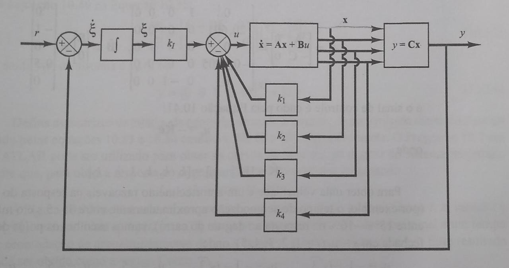
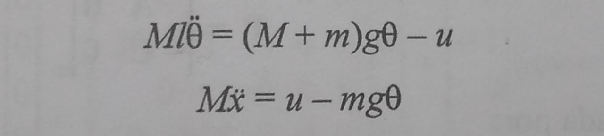
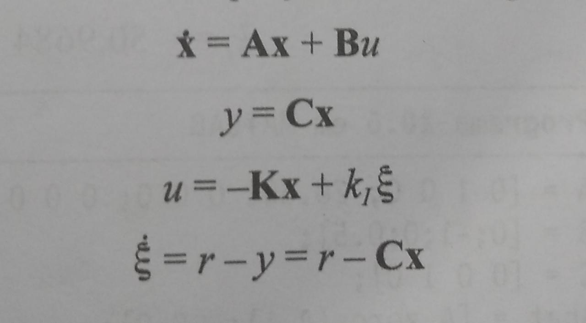
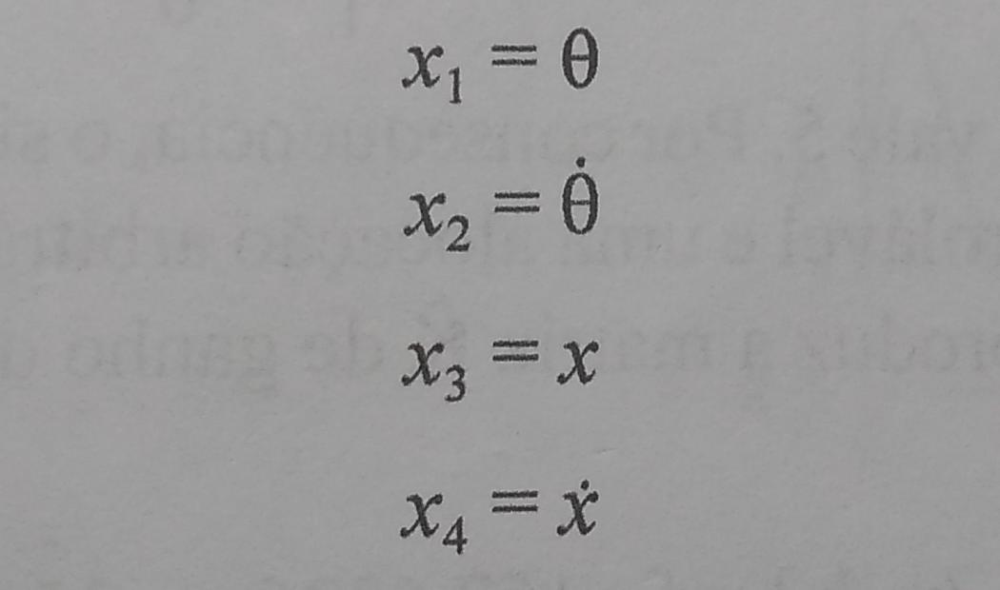

## 1. Pêndulo invertido - RAS (Robotics and Automation Society)
[texto pequeno falando sobre o pêndulo]

### 2. Modelagem matemática do problema
[cap 3 do ogata]

### 3. Projeto de servossistemas do tipo 1 quando a planta não possui integrador

O sistema de controle do pêndulo é dado por:

Onde:

| Símbolo | Significado |
| -- | -- |
| r | Perturbação do sistema. um degrau, por exemplo |
| csi | Integral do Erro |
| K | Ganho de realimentação (depende da alocação de polos) |
| KI  | Ganho de controle |
| u   | Sinal de controle |
| x'  | Planta |
| y   | saída |

  Do módulo 2. Sabemos que Para ângulos pequenos (entre -30º e 30º) o sin(teta) é igual a teta. Portanto as equações matemáticas podem ser dadas por:

  

  E as equações de controle são dadas por:

  

  Com vetor planta de estado definido da forma:

  

  Onde:
  * x1 é ângulo teta.
  * x2 é velocidade angular.
  * x3 é posição x do carro.
  * x4 é velocidade do carro.
